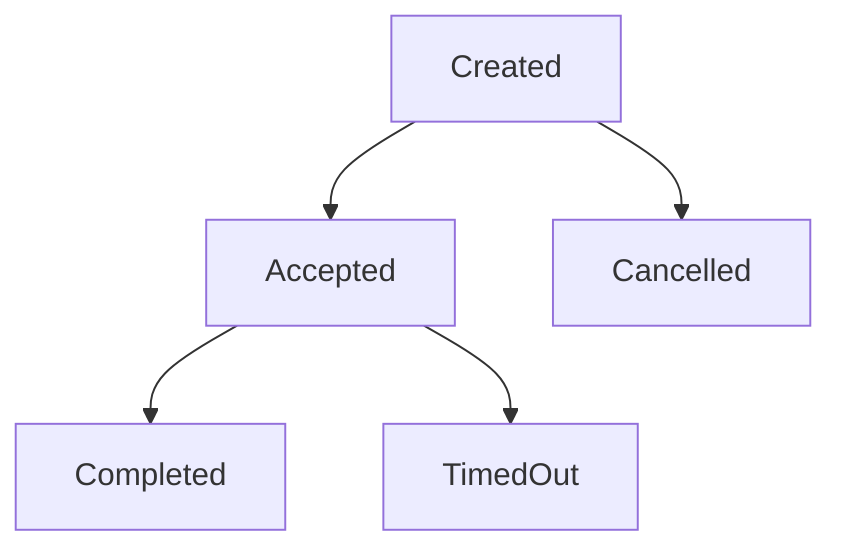

# Solana Escrow Engine

A production-ready on-chain escrow system built with Rust and the Anchor framework for Solana. This project demonstrates how classic Web2 backend patterns can be reimplemented as trustless, decentralized smart contracts.

## What is Escrow?

### Web2 Escrow (Traditional)

In traditional Web2 systems, escrow works as follows:

1. **Centralized Trust**: A trusted third party (escrow service) holds funds
2. **Database Storage**: Transaction state is stored in centralized databases
3. **Manual Processes**: Dispute resolution requires human intervention
4. **Single Point of Failure**: The escrow service controls all funds and decisions
5. **Counterparty Risk**: Users must trust the escrow provider won't disappear with funds

**Example Flow:**
```
Buyer → Deposits $100 to EscrowCorp database
Seller → Ships product and marks "delivered"
EscrowCorp → Manually verifies and releases funds to seller
```

### Solana Escrow (Decentralized)

Our on-chain implementation eliminates intermediaries:

1. **Trustless Smart Contract**: Rust program enforces rules automatically
2. **On-chain State**: All data stored transparently on Solana blockchain
3. **Automated Resolution**: Timeout mechanisms provide automatic dispute resolution
4. **No Intermediary**: No third party can access or control escrowed funds
5. **Cryptographic Security**: Funds protected by blockchain consensus and cryptography

**Example Flow:**
```
Buyer → Creates escrow account and deposits 100 USDC via smart contract
Seller → Accepts escrow by signing transaction
Buyer → Confirms delivery, smart contract automatically releases funds
```

## Key Features

- **Create Escrow**: Buyer deposits SOL or SPL tokens with configurable timeout
- **Seller Acceptance**: Seller commits to delivery by accepting the escrow
- **Delivery Confirmation**: Buyer confirms receipt and funds are automatically released
- **Cancellation**: Buyer can cancel before seller acceptance
- **Timeout Resolution**: Automatic release to seller after timeout (prevents buyer abuse)
- **Full Transparency**: All actions recorded on-chain with transaction history

## Architecture

### Smart Contract Components

1. **Escrow Account**: PDA (Program Derived Address) storing escrow metadata
2. **Vault Token Account**: Holds the escrowed funds securely
3. **State Machine**: Manages transitions between Created → Accepted → Completed/Cancelled/TimedOut

### State Transitions



## Tradeoffs & Constraints

### Advantages of On-Chain Escrow

✅ **Trustless**: No intermediary can steal or misuse funds  
✅ **Transparent**: All transactions visible on blockchain  
✅ **Automatic**: Smart contract enforces rules without human intervention  
✅ **Global**: Works 24/7 without geographical restrictions  
✅ **Composable**: Can be integrated into other DeFi protocols  
✅ **Lower Fees**: No intermediary taking percentage cuts  

### Limitations & Constraints

❌ **Gas Costs**: Each operation requires SOL for transaction fees  
❌ **Immutable Logic**: Smart contract bugs require new deployments  
❌ **Limited Dispute Resolution**: No human judgment for complex disputes  
❌ **Technical Barriers**: Users need crypto wallets and basic blockchain knowledge  
❌ **Scalability**: Limited by Solana's TPS compared to centralized databases  
❌ **Oracle Dependencies**: Real-world delivery confirmation still requires trust  

### Design Decisions

1. **Timeout Favors Seller**: Prevents buyer from holding funds indefinitely
2. **PDA-based Architecture**: Deterministic addresses for easy lookup
3. **SPL Token Support**: Works with any Solana token, not just SOL
4. **Anyone Can Resolve Timeout**: Permissionless dispute resolution
5. **No Partial Releases**: Simplifies state management and reduces attack vectors

## Installation & Setup

### Prerequisites

- Rust 1.70+
- Solana CLI 3.0+
- Anchor Framework 0.32+

### Build the Program

```bash
# Clone the repository
git clone https://github.com/Mint-Claw/solana-escrow-engine.git
cd solana-escrow-engine

# Build the smart contract
anchor build

# Run tests
anchor test
```

### Deploy to Devnet

```bash
# Configure Solana for devnet
solana config set --url https://api.devnet.solana.com

# Create and fund a keypair
solana-keygen new --outfile ~/.config/solana/id.json
solana airdrop 2

# Deploy the program
anchor deploy --provider.cluster devnet
```

## Usage

### CLI Client

Build and use the CLI client for testing:

```bash
# Build the CLI
cd cli
cargo build --release

# Create an escrow for 100 USDC with 24-hour timeout
./target/release/escrow-cli create \
  --mint EPjFWdd5AufqSSqeM2qN1xzybapC8G4wEGGkZwyTDt1v \
  --amount 100000000 \
  --timeout 86400 \
  --description "MacBook Pro 16-inch delivery"

# Accept the escrow (as seller)
./target/release/escrow-cli accept --escrow <ESCROW_ADDRESS>

# Confirm delivery (as buyer)
./target/release/escrow-cli confirm \
  --escrow <ESCROW_ADDRESS> \
  --seller-token-account <SELLER_TOKEN_ACCOUNT>

# Get escrow information
./target/release/escrow-cli info --escrow <ESCROW_ADDRESS>
```

### JavaScript SDK Example

```javascript
import { Connection, PublicKey } from '@solana/web3.js';
import { Program, AnchorProvider, BN } from '@coral-xyz/anchor';

const connection = new Connection('https://api.devnet.solana.com');
const program = new Program(IDL, programId, provider);

// Create escrow
await program.methods
  .createEscrow(new BN(100_000_000), new BN(86400), "Laptop delivery")
  .accounts({
    buyer: buyerKeypair.publicKey,
    escrow: escrowPda,
    mint: usdcMint,
    buyerTokenAccount: buyerAta,
    vaultTokenAccount: vaultPda,
  })
  .rpc();
```

## Testing

The project includes comprehensive tests covering all escrow flows:

```bash
# Run all tests
anchor test

# Run with verbose output
anchor test -- --nocapture
```

### Test Coverage

- ✅ Escrow creation with token deposit
- ✅ Seller acceptance flow
- ✅ Successful delivery confirmation
- ✅ Buyer cancellation before acceptance
- ✅ Timeout resolution after deadline
- ✅ Error handling for invalid state transitions
- ✅ Authorization checks for buyers and sellers

## Devnet Deployment

**Program ID**: `6ChaRcWmP5YJg21Z6AL6B6zxG8vNPJfx2EZhwFJUPeKt`

### Transaction Examples

- **Escrow Creation**: [View on Explorer](https://explorer.solana.com/tx/[TX_HASH]?cluster=devnet)
- **Seller Acceptance**: [View on Explorer](https://explorer.solana.com/tx/[TX_HASH]?cluster=devnet)
- **Delivery Confirmation**: [View on Explorer](https://explorer.solana.com/tx/[TX_HASH]?cluster=devnet)

## Security Considerations

1. **Reentrancy Protection**: All external calls happen after state changes
2. **Integer Overflow**: Using Rust's built-in overflow protection
3. **Authorization Checks**: Proper validation of signer permissions
4. **PDA Derivation**: Secure seed generation prevents account collision
5. **State Validation**: Comprehensive checks for valid state transitions

## Future Enhancements

- **Multi-signature Escrows**: Support for multiple parties
- **Partial Releases**: Milestone-based payment releases
- **Oracle Integration**: Real-world delivery confirmation
- **Dispute Resolution**: Decentralized arbitration system
- **Fee Collection**: Protocol fees for sustainability
- **Cross-chain Support**: Bridge to other blockchain networks

## Contributing

1. Fork the repository
2. Create a feature branch (`git checkout -b feature/amazing-feature`)
3. Commit your changes (`git commit -m 'Add amazing feature'`)
4. Push to the branch (`git push origin feature/amazing-feature`)
5. Open a Pull Request

## License

This project is licensed under the MIT License - see the [LICENSE](LICENSE) file for details.

## Superteam Poland Bounty

This project was built for the Superteam Poland bounty "Rebuild production backend systems as on-chain Rust programs" - demonstrating how traditional escrow services can be reimplemented as trustless, decentralized smart contracts on Solana.

**Submission Requirements Met:**
- ✅ Rust + Anchor framework implementation
- ✅ Deployed to Devnet with transaction links
- ✅ Public GitHub repository
- ✅ Comprehensive README with Web2 vs On-chain comparison
- ✅ CLI client for testing all functionality
- ✅ Production-ready code with proper error handling

---

Built with ❤️ for the Solana ecosystem